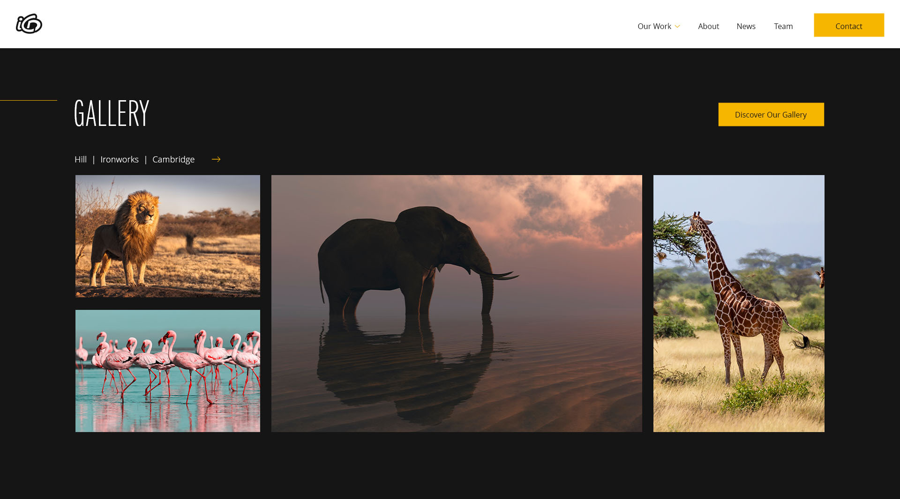
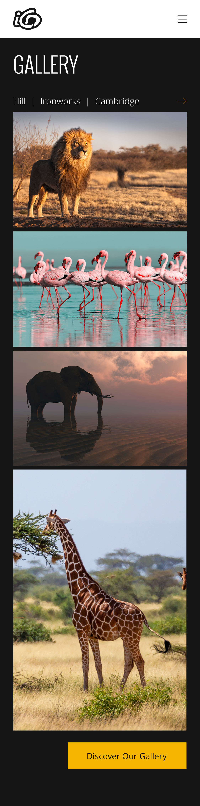

# Eye Candy Design Web Developer Trial

## Project Overview

This project is a responsive web page created as part of a technical trial for a web developer position at Eye Candy Design. The task was to replicate a provided visual design using HTML and Tailwind CSS, ensuring both desktop and mobile responsiveness.

## Technologies Used

- **HTML5**
- **Tailwind CSS**
- **Google Fonts**

## Project Structure

```
iCandy-Design/
├── .gitignore
├── index.html
├── package-lock.json
├── package.json
├── src/
│   ├── images/
│   │   ├── elephant.jpeg
│   │   ├── flamingo.jpeg
│   │   ├── giraffe.jpeg
│   │   ├── lion.jpeg
│   │   └── logo.svg
│   └── styles/
│       └── styles.css
├── tailwind.config.js
└── README.md
```

## Installation and Setup

### Downloading the Repository

You can download the repository from GitHub by visiting [PinkyCodeMaster/iCandy-Design](https://github.com/PinkyCodeMaster/iCandy-Design) and clicking on the "Code" button, then selecting "Download ZIP".

### Cloning the Repository

Alternatively, you can clone the repository using Git:

```bash
git clone https://github.com/PinkyCodeMaster/iCandy-Design.git
cd iCandy-Design
```

### Installing Dependencies

Ensure you have Node.js and npm installed. Then, install the project dependencies:

```bash
npm install
```

### Building Tailwind CSS

Run the following command to build the Tailwind CSS:

```bash
npx tailwindcss -i ./src/styles/styles.css -o ./dist/output.css --watch
```

### Viewing the Project

Open `index.html` in your browser to view the project.

## Customization and Usage

- **HTML Structure**: The HTML file (`index.html`) contains the main structure of the web page.
- **CSS Styling**: Tailwind CSS is used for styling, with custom styles defined in `src/styles/styles.css`.
- **Images**: All images and logos are stored in the `src/images` directory.

## Features

- **Responsive Design**: The layout adjusts seamlessly between desktop and mobile views.
- **Gallery Section**: A responsive gallery section displaying four images.
- **Custom Fonts**: Utilizes Google Fonts ('Oswald' for headings and 'Open Sans' for body text).

## Fonts and Colors

- **Primary Color**: `#F6B600` (Yellow)
- **Secondary Color**: `#151515` (Black)
- **Fonts**:
  - **Oswald**: Light (Headings)
  - **Open Sans**: Light (Body)

## Screenshots

### Desktop Design


### Mobile Design


## Contact

If you have any questions or need further assistance, please contact:

**Scott Jones**  
Founder, Net Guru Solutions  
Email: [scottjones@netgurusolutions.co.uk](mailto:scottjones@netgurusolutions.co.uk)  
Phone: +44 7752 297733  
